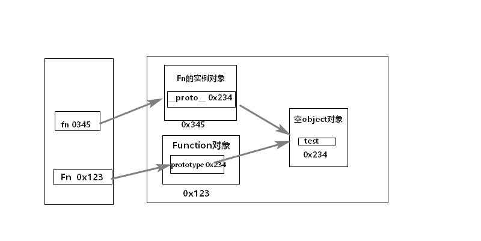
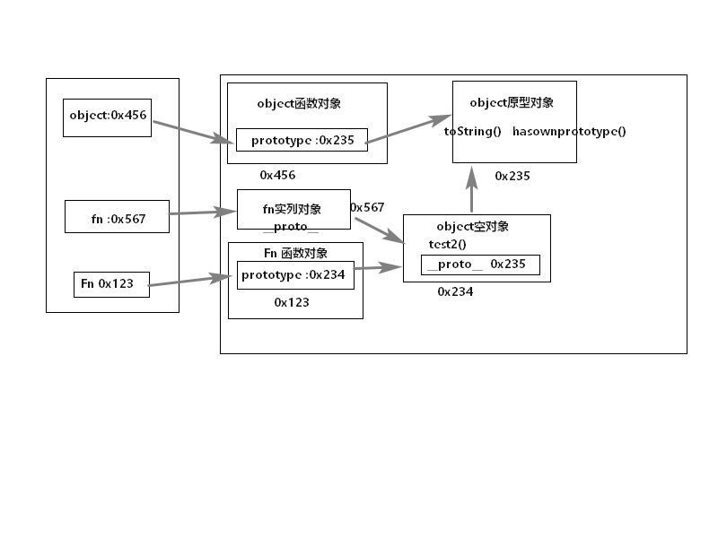

### 对象

用来保存多个数据的容器

由属性和方法组成

```js
let p={
    name:'tom',
    age:12,
    setName:function(name){
        this.name = name;
    },
    setAge;function(age){
        this.age = age
    }
}
p.setName('Bom')
p['setAge'](23)
console.log(p.name,p['age'])//'Bom' 23
```

### 函数

回调函数

匿名函数自调用

```js
(function(){
    console.log("...")
})()


////////
(function(){
    var a = 1
    function test(){
        console.log(++a)
    }
    window.$ = function(){ //向外暴露一个全局函数
        return {
            test:test
        }
    }
})()
$().test() ///2
```

关于this的问题

所有函数内部都有一个变量this

它的值是调用函数的当前对象

```js
function Person(color){
    console.log(this)
    this.color = color
    this.getColor = function(){
        console.log(this)
        return this.color
    };
    this.setColor = function(color){
        console.log(this)
        this.color = color;
    }
};
Person('red') //this是window 

var p = new Person('yellow');//this是p

p.getColor();//this是p

var obj = {};
p.setColor.call(obj,'black')//this是obj

var test = p.setColor;
test();//this是window
```

### 函数高级

#### 原型

1 函数的prototype属性

+  每一个函数都有一个prototype属性，它默认指向一个object空对象（即称：原型对象）

+ 原型对象中有一个属性constructor，它指向函数对象

2. 给原型对象添加属性(一般是方法 )
   + 作用：函数所有实列对象自动拥有原型中的属性 

```JS
function Fn(){
    
}
console.log(Fn.prototype) //默认指向一个object空对象

//1.添加方法
Fn.prototype.test = function(){
    console.log(test)
}
console.log(Fn.prototype) //此时object中有test函数属性
//调用test
var f = new Fn()
f.test()


//2.原型对象中有一个属性constructor，它指向函数对象

console.log(Fn.prototype.constructor === Fn)
```

2.显示原型和隐式原型

​    1.每个函数都有一个prototype,即是显式原型（属性）

​     2.每一个实例对象都有一个___proto__,即可称为隐式原型（属性）

​     3.对象的隐式原型的值为其对应构造函数的显示原型的值

​     4.总结：

​              函数的prototype属性：在定义函数时自动添加，默认为object对象

​              对象的__proto__属性，创建对象时自动添加，默认值为构造函数的prototype属性值。

​              程序员能直接操作显示原型，不能直接操作隐式原型（es6之前）

```	js
function Fn(){
    
}
// 1.每个函数都有一个prototype,即是显式原型（属性）
console.log(Fn.prototype) //object
//  2.每一个实例对象都有一个___proto__,即可称为隐式原型（属性）
var fn = new Fn()
console.log(fn.__proto__) //object
// 3.对象的隐式原型的值为其对应构造函数的显示原型的值
console.log(Fn.prototype === fn.__proto__) //true
 //4.添加方法
Fn.prototype.test = function(){
    
}
fn.test()
```



#### 原型链

1.原型链

访问一个属性时，先在自身属性中查找，找到返回，如果没有，再沿着 __proto__这条链上查找，找到返回，如果最终没有找到，返回undefined

```js
function Fn(){
    this.test1 = function(){
        console.log('test1')
    }
}
Fn.prototype.test2 = function(){
    cosnole.log('test2')
}
var fn = new Fn()
fn.test1()
fn.test2()
console.log(fn.toString())
fn.test3()  //找不到 undefined   报错
```



```js
function Fn(){}

Fn.prototype.a = 'xx'
var fn1 = new Fn();
console.log(fn1.a) ///'xx'

var fn2 = new Fn();
fn2.a = 'yyy';
console.log(fn1.a,fn2.a) //'xx','yyy'

//一般情况是属性放到函数里面
function Person(name,age){
    this.name = name;
    this.age = age;
}
Person.prototype.setName = function (name) {
    this.name = name;
}
var p1 = new Person("Tom",12)
p1.setName('Bob');
console.log(p1) //'Bob'
```

  