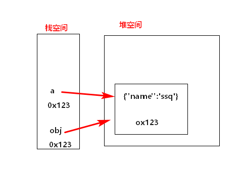

 ### 1.数据类型

#### 分类

基本类型： String、Number、boolean、null、undefined。 

引用类型：object.、function、Array、。 

#### 判断

1.typeof    返回数据类型的字符串表达 可以判断undefined/数值/字符串/布尔

```js
let a ;
console.log(a,typeof a ,typeof a === 'undefined') //undefined,'undefined',true
let a =4;
console.log(typeof a === 'number') //true
let a = 'ss';
console.log(typeof a === 'string') //true
let a = true
console.log(typeof a === 'boolean') //true
let a  = null
console.log(typeof a,a === null) //'object',true
```

2.instanceof  对象

```js
var b1 = {
    b2:[1,'abc',2],
    b3:function(){
        console.log('b3')
    }
}
console.log(b1 instanceof Object) //true
console.log(b1.b2 instanceof Array,b1.b2 instanceof Object) //true,true
console.log(b1.b3 instanceof Function,b1.b3 instanceof Object) //true ,true
console.log(typeof b1.b3 === 'function')//true
```

#### 实例

实例:实例对象

类型:类型对象

```js
function Person(name,age){//构造函数 //类型
    this.name = name
    this.age = age
}
var p = new Person()//根据类型创建的实例对象
```

### 问题

1.undefined和Null的区别

​	undefined代表定义但没有复值

​	null定义并复值,只是值为null

2.什么时候变量复值为Null

初始复值----结束复值

```js
var b = null //初次复制null,表明要复值的为对象
//确定对象就复值
b = {"aaa":"sss"}
//释放对象,让b指向的对象成为垃圾对象(垃圾回收器)
b = null
```

3.严格区别变量类型和数据类型

数据类型:

​		基本类型

​		对象类型

变量类型:

​		基本类型:保存的就是数据的值

​		引用类型:保存的是数据的地址

### 2.数据 变量 内存

数据:存储在内存中代表特定信息的东西

内存:内存条,一块小内存的2个数据

内存分类:	

  栈:全局变量/局部变量

  堆:对象

变量:

可变化的量,由变量名和变量值组成

每个变量都对应一小块内存,变量名用来查找对应的内存,变量值是内存中保存的数据

```js
var obj = {"name":'ssq'} //obj存在在栈中,{"aa":'qq'}在堆
var a = obj  //将对象地址复制给a
```



#### 问题

1. var a = xxxx ,a保存的是什么

   如果XXXx是基本数据,保存的是这个数据

   如果xxxx是对象,保存的是这个对象的地址

   如果xxxx是变量,保存的是XXX的内存内容(可能是基本数据,也可能是地址)

   ```js
   var b = 'ab'
   a = b //保存是基本数据
   b = {}
   a = b//保存的是地址
   ```

   

2.引用变量赋值的问题

共用一个地址,2个引用变量指向同一个对象

```js
var obj1 = {name:'jack'}
obj2 = obj1
obj1.name = 'bom'
console.log(obj2.name) //'bom'

/////////

var obj1 = {age:12}
obj2 = obj1
obj1 = {name:'tom',age:13}
obj2.age = 14
console.log(obj2.age,obj1.name,obj1.age) //14 'tom' 13

function fn(obj){
    obj = {age:15} //函数执行完,内部的局部变量会自动释放,成为垃圾对象
}
fn(obj1)
console.log(obj1.age)//13
```

3.在js 调用时传递变量参数时,是值传递还是参数传递

理解1:都是值(基本值/地址值)传递

理解2:可能是值传递,可能是引用传递

```js
let a =3
function fn (a){
    a =  a+1
    console.log(a)//4
}
fn(a)
console.log(a) //3

/////////////////////

function fn2(obj){
   console.log(obj.name) //'ssq'
}
obj = {name:'ssq'}
fn2(obj)
```

4.JS引擎如何管理内存

1.内存生命周期

​	分配小内存空间,得到它的使用权

   存储数据,可以进行反复操作

2. 释放内存空间

   局部变量:函数执行完自动释放

   对象:成为垃圾对象,===>由垃圾回收器回收

```js
var a = 3;
var obj = {}
obj = null
///都有空间
function fn(){
    var b = 4;
}
fn() ///b 是自动释放,b 所指向的对象在后面某个时刻由垃圾回收机制回收
```

### 变量提升和函数提升

1.变量声明提升

  通过var 定义(声明)的变量,在定义语句之前就可以访问到;

  值:undefined;

2.函数声明提升

  通过function声明的函数,在之前就可以直接调用

  值:函数定义(对象)

```js
var a = 3;
function fn(){
    console.log(a);
    var a = 4;
}
fn() //undefined  变量提升

//函数提升

fn2() //可调用,函数提升
function fn2(){
    
}
```

### 执行上下文

1.代码分类

   全局代码

   函数局部代码

2.全局执行上下文

   在执行去全局代码前将window确定为全局执行上下文

   对全局数据进行预处理

​         1.var定义全局变量===>undefined,添加为window的属性

​         2.function声明的全局函数===>赋值,添加window的方法

​          3.this===>赋值(window)

  开始执行全局代码

3. 函数执行上下文

   在调用函数,准备执行函数之前,创建对应的函数执行上下文对象

   对局部函数进行预处理

   ​     1.形参变量===>赋值(赋值)===>添加执行上下文属性

   ​     2.argument===>赋值 ===>添加执行上下文属性

   ​     3.var定义全局变量===>undefined,添加为window的属性

   ​     4.function声明的全局函数===>赋值,添加window的方法

   ​      5.this===>赋值(window)

   开始执行函数体代码

### 执行上下文栈

1.全局代码执行前,JS引擎就会创建一个栈来存储管理所有执行上下文对象

2.在全局执行上下文确定后,将其添加到栈中

3.在函数执行上下文创建后,将其添加到栈中

4.在当前函数执行完后,将栈顶的对象移除栈

5.当所有的代码执行完成后,栈中只剩下window

```js
var a = 10;
var bar = function (x) {
    var b = 5;
    foo(x+b);
}
var foo = function (y) {
    var c = 5;
    console.log(a+c+y);
}
bar(10)
```

 面试题:

```js
console.log("g":i) //'g',undefined
var i = 1;
foo(1);
function foo(i) {
    if(i ===4){
        return
    }
    console.log('fb':i);//输出顺序 fb1,fb2,fb3
    foo(i+1)//递归调用
    console.log('fe':i)  //输出顺序 fe3,fe2,fe1
}
```

函数作用域的问题

```js
var x = 10 ;
function fn () {
    console.log(x)
}
function show (f) {
    var x = 20;
    f()
}
show(fn) //10
```

