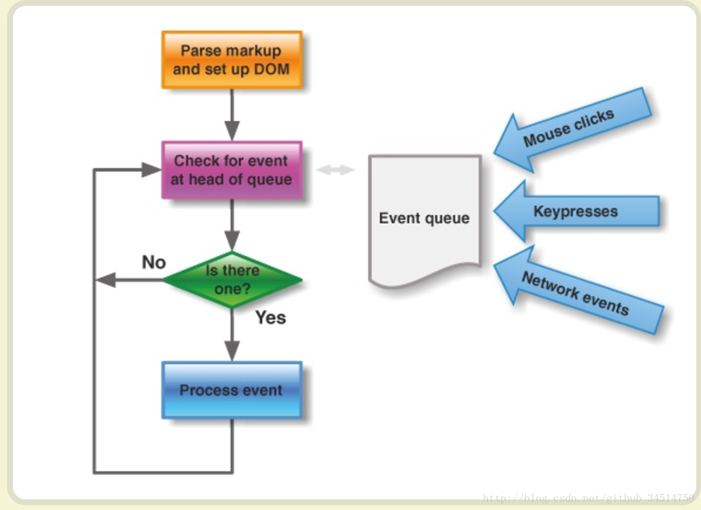
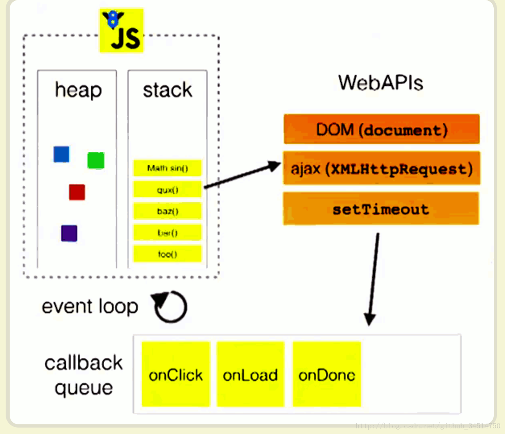

### 进程与线程

进程:程序的一次执行,它占有独立的内存空间(任务管理器可以查看)

线程:是进程内的一个独立执行单元,是程序执行的一个完整流程,是cpu的最小的调度单位

注意:

1.应用程序必须运行在某个进程的某个线程上

2.一个进程中至少有一个运行的线程:主线程,进程启动后自动创建

3.一个进程中也可以同时运行多个线程,即程序是多线程的说法

4.一个进程内的数据可以提高其中多个线程直接共享

5.多个进程直接的数据是不能直接共享的

### 浏览器

#### JS

JS是单线程,但可以使用H5中的Web Workers可以多线程运行.

JavaScript语言的设计者意识到，这时主线程完全可以不管IO设备，挂起处于等待中的任务，先运行排在后面的任务。等到IO设备返回了结果，再回过头，把挂起的任务继续执行下去。

于是，所有任务可以分成两种，一种是同步任务（synchronous），另一种是异步任务（asynchronous）。

#### 浏览器

浏览器是多线程运行的

**下面总结一下各常用浏览器所使用的内核。**
 1、IE浏览器内核：Trident内核，也是俗称的IE内核；
 2、Chrome浏览器内核：统称为Chromium内核或Chrome内核，以前是Webkit内核，现在是Blink内核；
 3、Firefox浏览器内核：Gecko内核，俗称Firefox内核；
 4、Safari浏览器内核：Webkit内核；
 5、Opera浏览器内核：最初是自己的Presto内核，后来是Webkit，现在是Blink内核；
 6、360浏览器、猎豹浏览器内核：IE+Chrome双内核；
 7、搜狗、遨游、QQ浏览器内核：Trident（兼容模式）+Webkit（高速模式）；
 8、百度浏览器、世界之窗内核：IE内核；
 9、2345浏览器内核：以前是IE内核，现在也是IE+Chrome双内核；

**内核有很多模块组成**

主线程

1.js引擎模块:负责js程序的编译与运行

2.html/css文档解析模块:负责页面文本的解析

3.DOM/CSS模块,负责dom/css在内存中的相关处理

4.布局和渲染模块:负责页面的布局和效果绘制

..............

分线程

定时器模块:负责定时器的管理

事件响应模块:负责事件的管理

网络请求模块:负责ajax请求


 所以异步是浏览器的两个或者两个以上线程共同完成的。比如ajax异步请求和setTimeout 

参考博客: https://blog.csdn.net/github_34514750/article/details/76577663 

#### 同步任务和异步任务

同步任务：在主线程排队支持的任务，前一个任务执行完毕后，执行后一个任务,形成一个执行栈，线程执行时在内存形成的空间为栈，进程形成堆结构，这是内存的结构。执行栈可以实现函数的层层调用。注意不要理解成同步代码进入栈中，按栈的出栈顺序来执行。
异步任务会被主线程挂起，不会进入主线程，而是进入消息队列，而且必须指定回调函数，只有消息队列通知主线程，并且执行栈为空时，该消息对应的任务才会进入执行栈获得执行的机会。

主线程执行的说明: 【js的运行机制】
（1）所有同步任务都在主线程上执行，形成一个执行栈。
（2）主线程之外，还存在一个”任务队列”。只要异步任务有了运行结果，就在”任务队列”之中放置一个事件。
（3）一旦”执行栈”中的所有同步任务执行完毕，系统就会读取”任务队列”，看看里面有哪些事件。那些对应的异步任务，于是结束等待状态，进入执行栈，开始执行。
（4）主线程不断重复上面的第三步。



 **事件循环**
主线程从”任务队列”中读取事件，这个过程是循环不断的，所以整个的这种运行机制又称为Event Loop（事件循环）。 



上图中，主线程运行的时候，产生堆（heap）和栈（stack），栈中的代码调用各种外部API，它们在”任务队列”中加入各种事件（click，load，done）。只要栈中的代码执行完毕，主线程就会去读取”任务队列”，依次执行那些事件所对应的回调函数。

执行栈中的代码（同步任务），总是在读取”任务队列”（异步任务）之前执行。


### Web workers

多线程:

缺点:不是所有浏览器支持,不支持跨域加载js,不能访问dom


```js

var input = document.getElementById('number')
document.getElementById('btn').onclick = function () {
    var number = input.value;
    //创建一个worker对象
    var worker = new Worker('worker.js')
    //绑定接受消息的监听
    worder.onmessage = function (event) {
        console.log('主线程接受分线程返回的数据')
        console.log(event.data);
        
    };
    worder.postMessage(number)
    console.log('主线程向分线程发送数据' + number)
}
```

新建一个js文件 worker.js分线程去计算

注意:分线程的全局对象不是window,所以分线程不可以更新界面,一般用于长时间的计算

```js
function fib (n) {
    return n <=2 ? 1 :fib(n-1) + fib(n-2)
}

var onmessage = function (event) {
    var number = event.data;
    console.log('分线程接受到主线程发送的数据'+number)
    var result = fib(number);
    postMessage(result);
    console.log('分线程向主线程返回的数据'+result)
}
```


