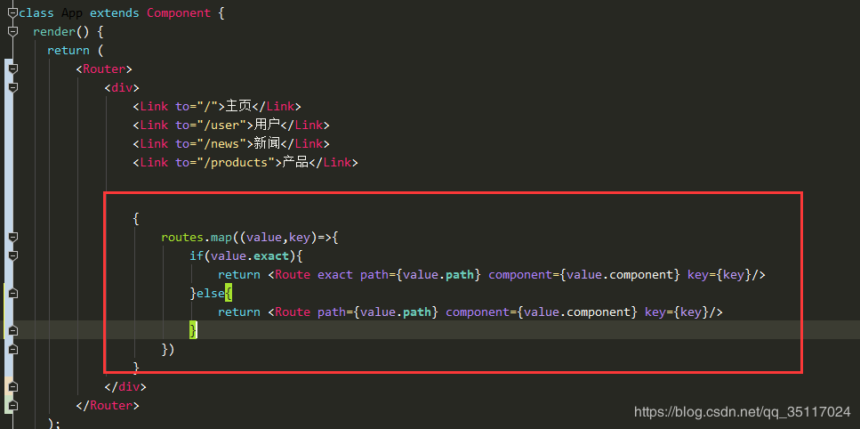

## 路由

### 基本配置

1、找到官方文档 https://reacttraining.com/react-router/web/example/basic

2、安装 cnpm install react-router-dom --save

3、找到项目的根组件引入react-router-dom

` import { BrowserRouter as Router, Route, Link } from "react-router-dom";`

 4、复制官网文档根组件里面的内容进行修改 （加载的组件要提前引入）

```js
import React, { Component } from 'react';

import { BrowserRouter as Router, Route, Link } from "react-router-dom";
import './assets/css/index.css'
import Home from './components/Home';
import News from './components/News';
import Product from './components/Product';

class App extends Component {

  render() {
    return (
        <Router>
          <div>           
              <header className="title">
              
                <Link to="/">首页</Link>

                <Link to="/news">新闻</Link>

                <Link to="/product">商品</Link>

              </header>
              <Route exact path="/" component={Home} />
              <Route path="/news" component={News} />    
              <Route path="/product" component={Product} />                 
          </div>
      </Router>
    );
  }
}

export default App;

```

### 动态路由传值

 1、动态路由配置

`<Route path="/content/:aid" component={Content} />  ` 

2、对应的动态路由加载的组件里面获取传值

` this.props.match.params`

跳转：<Link to={`/content/${value.aid}`}>{value.title}</Link>

### get传参

1.路由

` <Route path="/productcontent" component={ProductContent} />`

2.获取值

` this.props.location.search`

+ 可以利用node中url模块进行解析

+ 需要下载`npm install url --save`

+ url模块来解析url地址  在react里面使用url模块需要安装url模块  cnpm install url --save

+ import url from 'url';

+ 获取get传值

  ```js
  var query=url.parse(this.props.location.search,true).query;
  console.log(query)
  ```

跳转

 <Link to={`/productcontent?aid=${value.aid}`}>{value.title}</Link>

### JS路由跳转----重定向

1、要引入Redirect

```js
    import {
    BrowserRouter as Router,
    Route,
    Link,
    Redirect,
    withRouter
    } from "react-router-dom";
```

2、定义一个flag

```js
        this.state = { 
                loginFlag:false            
        };

```

3、render里面判断flag 来决定是否跳转

```js

        if(this.state.loginFlag){

            return <Redirect to={{ pathname: "/" }} />;
        }
```

4、要执行js跳转

```js
        通过js改变loginFlag的状态

        改变以后从新render 就可以通过Redirect自己来跳转
```

```js
import React, { Component } from 'react';

import {Redirect} from "react-router-dom";


class Login extends Component {
    constructor(props) {
        super(props);
        this.state = { 
            loginFlag:false            
        };
    }

    doLogin=(e)=>{

        e.preventDefault();
        

        let username=this.refs.username.value;

        let password=this.refs.password.value;


        console.log(username,password)

        if(username=='admin' && password=='123456'){

            //登录成功   跳转到首页

            this.setState({

                loginFlag:true
            })


        }else{

            alert('登录失败')
        }

    }
    render() {
        if(this.state.loginFlag){
            return <Redirect to='/' />;
        }
        return (    
            <div>
                 <br /> <br /> <br />

                <form onSubmit={this.doLogin}>

                        <input type="text"  ref="username" />  <br /> <br />

                        <input type="password"  ref="password" /> <br /> <br />

                         <input type="submit"  value="执行登录"/>

                </form>

               

            </div>
            
        );
    }
}

export default Login;
```

#### 标签式重定向

1.引入

```jsx
import { Link , Redirect } from "react-router-dom";
```

2.引入`Redirect`后，直接在`render`函数里使用就可以了。

```js
 <Redirect to="/home/" />
```

#### 编程时重定向

```jsx
this.props.history.push("/home/");  
```


### 嵌套路由

user.js

```js
import React, { Component } from 'react';

import { BrowserRouter as Router, Route, Link } from "react-router-dom";


import Info from './User/Info';
import Main from './User/Main';

class User extends Component {
    constructor(props) {
        super(props);
        this.state = { 
            msg:'我是一个User组件'
         };
    }    
    render() {
        return (
            <div className="user">        
               <div className="content">
                   <div className="left">
                        <Link to="/user/">个人中心</Link>
                        <Link to="/user/info">用户信息</Link>

                    </div>

                    <div className="right">

                            
                            <Route exact path="/user/" component={Main} />

                            <Route  path="/user/info" component={Info} />

                    </div>


               </div>


            </div>
        );
    }
}

export default User;

```

App.js

```js
import React, { Component } from 'react';

import { BrowserRouter as Router, Route, Link } from "react-router-dom";

import Home from './components/Home';

import User from './components/User';

import './assets/css/index.css'

class App extends Component {

  render() {
    return (

      <Router>
        <div>


          <header className="title">

             <Link to="/">首页组件</Link>

             <Link to="/user">用户页面</Link>

          </header>
           <Route exact path="/" component={Home} />
           <Route path="/user" component={User} />
    </div>
      </Router>
    );
  }
}

export default App;

```

### 路由模块化

博客: https://blog.csdn.net/qq_35117024/article/details/83750982 

#### 封装一

把路由定义成一个数组 routes,配置的时候循环数组，配置如下：

1.在src目录下新建一个route目录，在此目录下新建一个routers组件 


```js
let routes =[
  {
    path :'/',
    component:Home,
    exact:true,
  },
  {
    path :'/user',
    component:User,
  },
  {
    path :'/shop',
    component:Shop,

  },

]
```

2.所需组件中我们只需引入上述这个路由组件就完成了路由的模块化 



```jsx
import routes from '../router/routers'

class App extends Component {
  render() {
    return (
        <Router>
          <div>
            {/*上面显示两个标题*/}
            <header className="title">
              <Link to="/">首页组件</Link>
              <Link to="/user">用户页面</Link>
              <Link to="/shop">商户页面</Link>
            </header>

            {/*循环配置路由*/}
            {
              routes.map( (value,key)=> {
                //判断默认路由
                if (value.exact){
                  return <Route key={key} exact path={value.path} component={value.component}/>;
                } else{
                  return <Route key={key} path={value.path} component={value.component}/>;
                }
              })
            }

          </div>
        </Router>
    );
  }
}

export default App;

```

### 路由嵌套

1.新建组件后我们在路由文件里面配置这两个文件的路由，在user路由下配置两个子路由 


```jsx
import Shop from '../components/Shop';
import Home from '../components/Home';
import User from '../components/User';
import UserList from '../components/User/UserList';
import UserAdd from '../components/User/UserAdd';
import UserEdit from '../components/User/UserEdit';

/**
 * 模块化，配置嵌套路由
 * 
 */
let routes = [
    {
        path: "/",
        component: Home,
        exact:true
    },
    {
        path: "/shop",
        component: Shop
    },
    {
        path: "/user",
        component: User,
        /*嵌套路由*/
        routes:[
            {
                path: "/user/",
                component: UserList
            },
            {
                path: "/user/add",
                component: UserAdd
            },
            {
                path: "/user/edit",
                component: UserEdit
            }
        ]
    },

];

export default routes;

```

2.然后我们在所需组件中修改我们之前的路由循环写法 


```jsx
import React, {Component} from 'react';

import './assets/css/App.css';

import {BrowserRouter as Router, Route, Link} from "react-router-dom";
import routes from './model/router.js';


class App extends Component {
    render() {
        return (
            <Router>
                <div>
                    {/*上面显示两个标题*/}
                    <header className="title">
                        <Link to="/">首页组件</Link>
                        <Link to="/user">用户页面</Link>
                        <Link to="/shop">商户页面</Link>


                    </header>


                    {/*循环配置路由*/}
                    {
                        routes.map((route, key) => {

                            if (route.exact) {
                                return <Route key={key} exact path={route.path}
                                     // route.component     value.component
                                    //  下面的代码，相当于 <User  {...props}  routes={route.routes} />
                                    //  route.routes 把值传给 User 组件
                                              render={props => (
                                                  // pass the sub-routes down to keep nesting
                                                  <route.component {...props} routes={route.routes}/>
                                              )}

                                />
                            } else {
                                return <Route key={key} path={route.path}
                                              render={props => (
                                                  // pass the sub-routes down to keep nesting
                                                  <route.component {...props} routes={route.routes}/>
                                              )}
                                />

                            }
                        })
                    }

                </div>
            </Router>
        );
    }
}

export default App;

```

 3.最后我们在User组件中获取我们根组件传过去的参数，然后遍历User组件的子路由写法 


```jsx

import React, {Component} from 'react';

import {BrowserRouter as Router, Route, Link} from "react-router-dom";

class User extends Component {
    constructor(props) {
        super(props);
        this.state = {
            msg: '我是一个User组件'
        };
    }

    componentWillMount() {
        //App.js 拿到传过来的值
        console.log(this.props.routes);
    }

    render() {
        return (
            <div className="user">
                <div className="content">
                    <div className="left">
                        <Link to="/user/">用户列表</Link>
                        <br/>
                        <br/>
                        <Link to="/user/add">增加用户</Link>
                        <br/>
                        <br/>
                        <Link to="/user/edit">编辑用户</Link>
                    </div>

                    <div className="right">
                        {
                            //App.js 拿到传过来的值,并循环配置路由
                            this.props.routes.map((route, key) => {

                                return <Route key={key} exact path={route.path} component={route.component}/>
                            })
                        }
                        {/* <Route  path="/user/add" component={UserAdd} /> */}
                    </div>


                </div>


            </div>
        );
    }
}

export default User;
```

