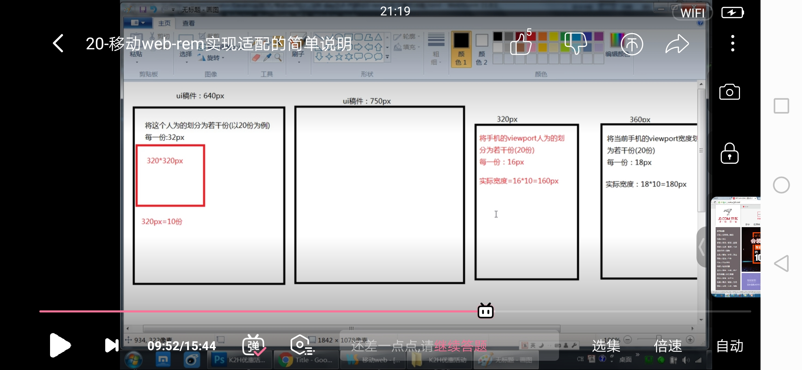

## 移动端适配

### 1.手动Rem布局

根据屏幕宽度动态改变font-size

1.需要将 网页的屏幕宽度等于视窗宽度 

```js
<meta name="viewport" content="width=device-width, initial-scale=1, maximum-scale=1">
```

2.动态改变font-size

```js
<script>
	((win,doc)=>{
		let res = ()=>{
			let width = doc.documentElement.clientWidth/16 // 动态设置rem的大小
			doc.getElementsByTagName('html')[0].style.fontSize = width + 'px'
		}
		res()
		win.onresize = ()=>{
			res()
		}
	})(window,document)

</script>
```

3.scss 将UI设计稿px转换为rem

```scss
@function nav($arg){
	@return $arg/ 46.875 *1rem;  //750/16 = 46.875,如果设计稿是750px 那么每rem应该对应46.875px， $arg/ 46.875计算该盒子有多少rem
}

*{
	margin:0;
	padding:0;
}

.box{
	width:nav(750);		
	height:nav(750);
	background:#ccc;
}

.link{
	width:nav(200);
	height:nav(200);
	background:#000;
}

```

4.html

```html
<!DOCTYPE html>
<html lang="en">
<head>
	<meta charset="UTF-8">
	<title>Document</title>
	<meta name="viewport" content="width=device-width, initial-scale=1.0">
	<script>
		((win,doc)=>{
			let res = ()=>{
				let width = doc.documentElement.clientWidth/16
				doc.getElementsByTagName('html')[0].style.fontSize = width + 'px'
			}
			res()
			win.onresize = ()=>{
				res()
			}
		})(window,document)

	</script>
	
	<link rel="stylesheet" href="./index.css">
</head>
<body>
	<div class="box"></div>
	<div class="link"></div>
	<script>
	</script>
</body>
</html>
```



### 2.lib-flexible

lib-flexible是一个制作H5适配的开源库. 动态改写meta标签 ,它自动添加font-size

阿里CDN

```js
<script src="http://g.tbcdn.cn/mtb/lib-flexible/{{version}}/??flexible_css.js,flexible.js"></script>
```


解析:lib-flexible会将页面分为100份, 而每一份被称为一个单位`a`。同时`1rem`单位被认定为`10a`。针对我们这份视觉稿可以计算出：(设计稿为750px为例） 

```shell
1a   = 7.5px
1rem = 75px 
```

那么我们这个示例的稿子就分成了`10a`，也就是整个宽度为`10rem`，``对应的`font-size`为`75px`：[·](http://caibaojian.com/flexible-js.html)

这样一来，对于视觉稿上的元素尺寸换算，只需要原始的`px值`除以`rem基准值`即可。例如此例视觉稿中的图片，其尺寸是`176px * 176px`,转换成为`2.346667rem * 2.346667rem`。(176/75)


来源：

```html
<!DOCTYPE html>
<html lang="en">
<head>
    <meta charset="UTF-8">
    <!-- <meta name="viewport" content="width=device-width, initial-scale=1.0"> -->
    <script src="http://g.tbcdn.cn/mtb/lib-flexible/0.3.4/??flexible_css.js,flexible.js"></script>
    <title>Document</title>
</head>
<script>
	// 适配pad padPro
    // /(pad|pod|iPad|iPod|iOS)/i.test(navigator.userAgent)&&(head=document.getElementsByTagName('head'),viewport=document.createElement('meta'),viewport.name='viewport',viewport.content='target-densitydpi=device-dpi, width=480px, user-scalable=no',head.length>0&&head[head.length-1].appendChild(viewport));
</script>


<style type='text/css'>
    div{
        /* width:200px;
        height:200px; */
        width:2.346667rem;
        height:2.346667rem;
        background-color: aquamarine;
    }
</style>
<body>
    <div></div>
</body>
</html>
```

2.sass中将px转化为rem

```scss
@function nav($arg){
	@return $arg/ 75 *1rem;
}
*{
	margin:0;
	padding:0;
}
div{
    // width:176px;
    // height:176px;
     width:nav(750);
     height:nav(750);
    background-color: aquamarine;
}
```


### 在vue中使用lib-flexible

1.下载并引入

```shell
npm install --save lib-flexible
```

在main.js中:

```shell
import 'lib-flexible'
```


2.引入px2rem(自动将px转化为rem)

在以前版本之前 参考博客: https://www.cnblogs.com/mica/p/10690785.html 

  下载:

```shell
npm install --save px2rem-loader
```

​    将px2rem-loader添加到cssLoaders 

   在build/util.js中添加如下代码 

```shell
const px2remLoader = {
   loader: 'px2rem-loader',
   options: {
     remUnit: 75//这个是重点，设计稿是750px
   }
 }
 
 
 
 const loaders = [cssLoader,px2remLoader]
```

3.在vue-cli3之前使用  参考博客: https://www.jb51.net/article/167353.htm 

安装:

```shell
npm i postcss-plugin-px2rem --save -dev
```

然后我们需要在vue.config.js中创建一个配置。由于在vue-cli3.X中。去掉了build和config文件夹。所有的配置都放到了vue.config.js，然而这个文件脚手架并没有生成，所以需要手动在项目的根目录创建一个文件

在vue.config.js里配置]

```shell
module.exports = {
  lintOnSave: true,
  css: {
    loaderOptions: {
      postcss: {
        plugins: [
          require('postcss-plugin-px2rem')({
            rootValue:75,      // 新版本的是这个值
            mediaQuery: false, //（布尔值）允许在媒体查询中转换px。
            minPixelValue: 3 //设置要替换的最小像素值(3px会被转rem)。 默认 0
          }),
        ]
      }
    }
  },
}
```

注意:适配ipad

在index.html中引入

```html

    <script>
      // 用于适配ipad以及ipad pro
      ;/(iPhone|iPad|iPhone OS|Phone|iPod|iOS)/i.test(navigator.userAgent) &&
        ((head = document.getElementsByTagName('head')),
        (viewport = document.createElement('meta')),
        (viewport.name = 'viewport'),
        (viewport.content =
          'target-densitydpi=device-dpi, width=480px, user-scalable=no'),
        head.length > 0 && head[head.length - 1].appendChild(viewport))
    </script>

```

