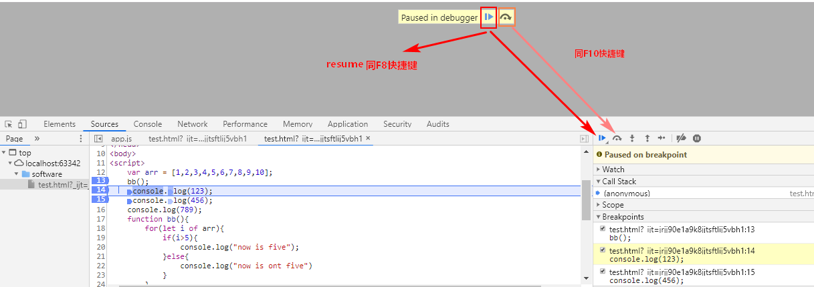
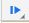
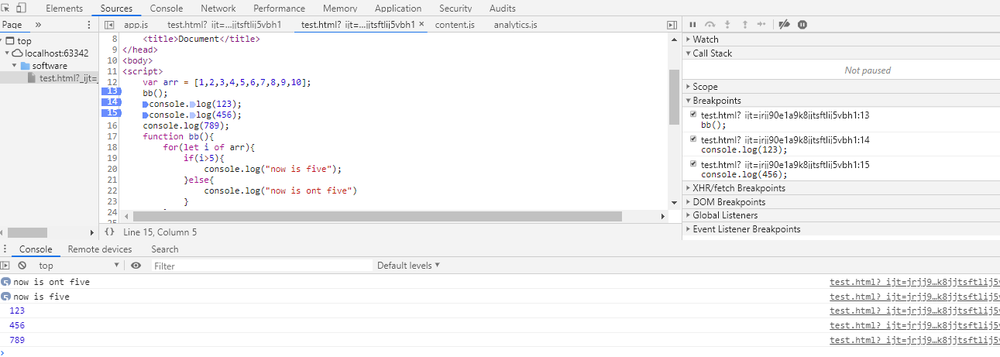
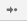
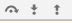
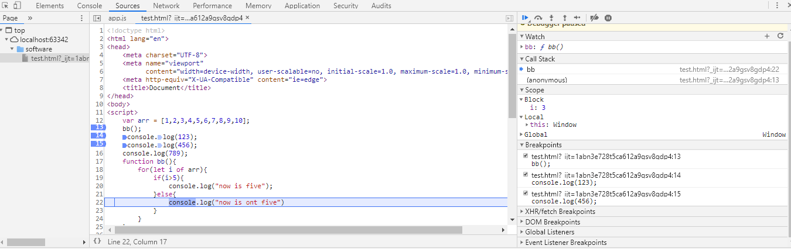

###### 1.进入Debug
 **在Source中找到需要调试的文件,在需要调试的那一行设置断点,刷新页面,代码就会执行到断点处暂停,即可开始Debug**



#### 2,开始Debug(debug 是不会改变程序执行的顺序的, 只会改变速度 按你的要求停下来  )

案列

```js
 var arr = [1,2,3,4,5,6,7,8,9,10];
    bb();
    console.log(123);
    console.log(456);
    console.log(789);
    function bb(){
        for(let i of arr){
            if(i>5){
                console.log("now is five");
            }else{
                console.log("now is ont five")
            }
        }
    }
```


##### 1.调试窗口



 **这个箭头是继续执行脚本的命令,如果后面还有断点,继续执行到下一个断点,没有断点直接执行到代码最后面** 



解析:第一次点击箭头,执行13行,直接输出5次"now is five",5次"now is not five",第二次点击,执行14行,输出123,第三次点击执行15行以及后面的代码,输出456,789;



**这个箭头是单步执行,即按照代码正常顺序,一步一步执行.区别于上面的箭头,它会进入到函数里面一步一步执行,而上面的函数直接输出结果.**


解析:第一次点击单步执行,进入到bb函数内部,单步执行,直到执行完函数,再依次执行14行,15行.



 **第一个箭头的作用是,直接执行完函数进行下一步,不会进入函数( 就是你看不到进入函数的那个过程 ) ; 第二个箭头是指进入函数逐步执行函数 ; 最后一个箭头是跳出函数 ;**


 **这个是注释断点,和代码的注释一样,仍旧显示但是不起作用,注释断点.**


 **这个图标激活之后,在代码出错之后会直接跳转到代码出错的那一行** 

##### 2.侧边展示栏



watch ---- 监听变量;

Call Stack ---当断点执行到某一程序块处停下来后，右侧调试区的`Call Stack` 会显示当前断点所处的方法调用栈，从上到下由最新调用处依次往下排列

Scope ---查看此时局部变量和全局变量的值;

Breakponits---展示断点

#### 3.退出Debug

删除所有断点.,然后点击继续执行箭头(F8),即可退出

